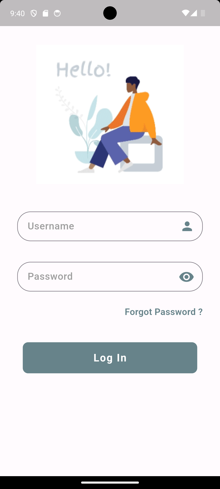
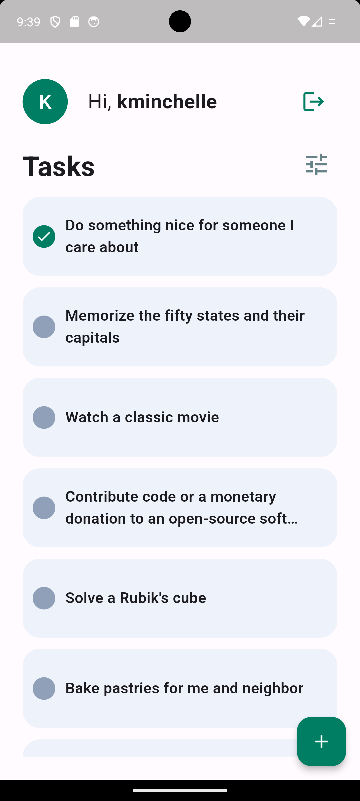
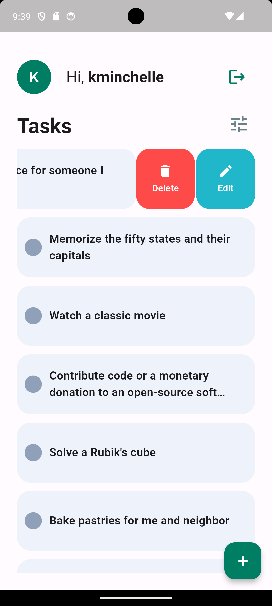
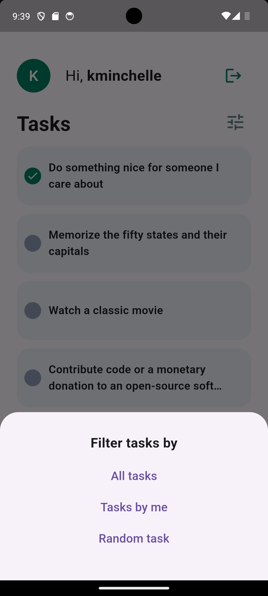
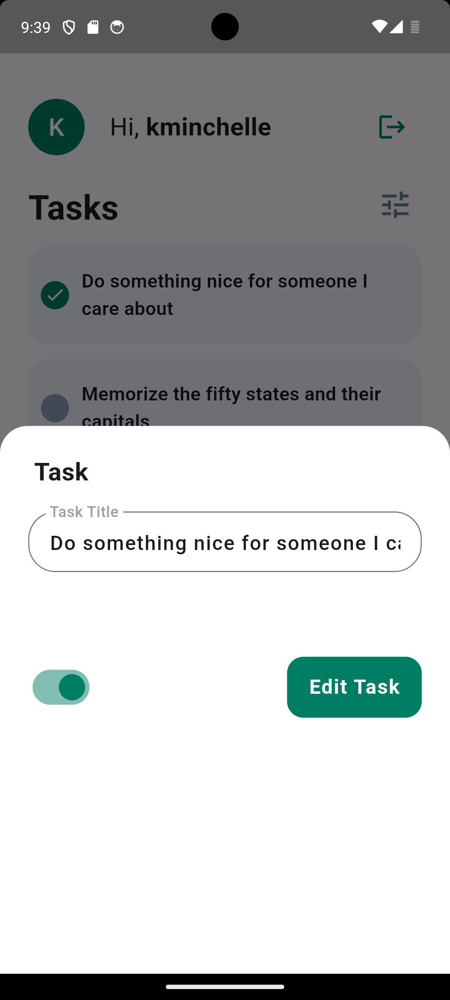

# task_manager

The Task Manager app is a robust and efficient tool designed to help users organize and manage their tasks effectively. With a focus on user authentication, task management, pagination, state management, local storage, and unit testing, this app offers a seamless and reliable experience for users to stay productive and organized.

1. MVC Design Pattern: Employed for structuring the app's architecture into Model, View, and Controller components, promoting maintainability and scalability.
2. Bloc for State Management: Utilized for efficient and predictable state management, facilitating separation of concerns and testability.
3. HTTP for API Requests: Leveraged for making HTTP requests to the backend API, enabling seamless communication and data exchange.
4. SharedPreferences for Local Data: Utilized for persisting data locally on the device, ensuring data accessibility and synchronization across app sessions.

